# Informe de Auditoría de Sistemas - Examen de la Unidad I

**Nombres y apellidos:** Ivan Francisco Málaga Espinoza
**Fecha:** 10/09/2025
**URL GitHub:** https://github.com/IvaFraMa/1UnidadExamenAuditoria_Malaga.git

---

## Pasos previos:

# Gestión de Riesgos para Activos Digitales

## Descripción del Proyecto
Identificación y gestión automatizada de riesgos en activos digitales, que utiliza modelos de lenguaje avanzados ejecutados localmente. La herramienta proporciona:

- Generación automática de perfiles de riesgo
- Análisis de impactos potenciales
- Recomendaciones de mitigación alineadas con ISO 27001
- Interfaz intuitiva para gestión de casos

## Tecnologías Implementadas

### Frontend
- **React 18** con **Vite** (entorno de desarrollo rápido)
- **Ant Design** (biblioteca de componentes UI profesional)
- **Axios** (para comunicación con el backend)

### Backend
- **Flask** (servidor web ligero en Python)
- **Ollama** (infraestructura local para modelos LLM)
- **LangChain** (orquestación de prompts avanzados)
- **LLAMA** (modelo de lenguaje para recomendaciones)

## Requisitos del Sistema

### Dependencias principales
- Visual Studio Code https://code.visualstudio.com
- Node.js v18+ (para el frontend) https://nodejs.org/en/download
- Python 3.9+ (para el backend o la versión más reciente) https://www.python.org/downloads/
- Ollama instalado localmente https://ollama.com
- Git (para clonar el repositorio) https://git-scm.com/downloads

## Instalación y Configuración

### 1. Clonar el repositorio
```bash
git clone https://github.com/OscarJimenezFlores/CursoAuditoria/tree/main/AuditoriaRiesgos
cd AuditoriaRiesgos
```

### 2. Configuración del FRONTEND
```bash
cd frontend
npm install

npm run dev

```
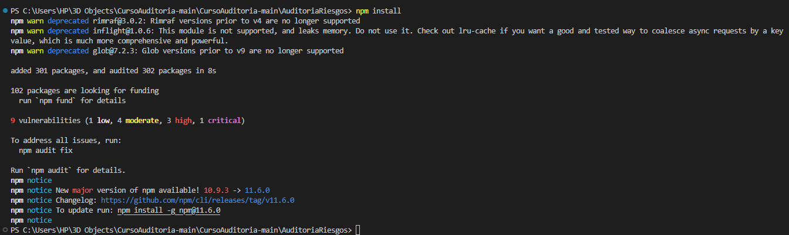
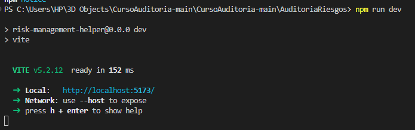
El FRONT estará disponible en: http://localhost:5173

### 3. Configuración del Backend

#### Para usuarios macOS
```bash
brew install ollama
ollama pull llama2:7b
ollama run llama2:7b
```

#### Para usuarios Windows

1. Descargar el instalador desde ollama.com (https://ollama.com)  
2. O puede ejecutar en la terminal de VsCode / PowerShell:

```bash
ollama pull llama2:7b
ollama run llama2:7b
```


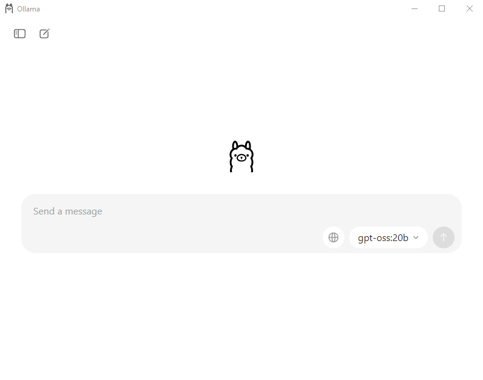

   Opcionalmente, puede verificar el estado del servicio:
```bash
tasklist | findstr ollama
```


### 4. Iniciar el BACKEND servidor Flask

```bash
python app.py
```

Nota: Si encuentras problemas con la versión de Python, prueba con el numero de versión Python que instalaste, por ejemplo:
```bash
python3.9 app.py
```
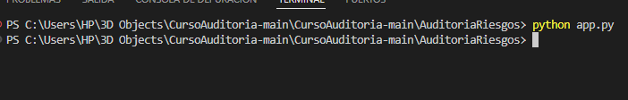

## Solución de Problemas Comunes

#### Errores de dependencias

Ejecuta:
```bash
npm ci --force  # Para frontend

pip install --upgrade -r requirements.txt  # Para backend
```
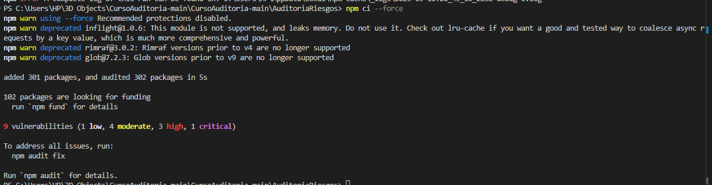

#### Problemas de compatibilidad

Asegúrate de tener instalado
- Node.js v18+
- Python 3.9+
- Ollama versión estable más reciente

#### Terminar Procesos en MAC terminal
```bash
# Para frontend (React)
pkill -f "npm run dev"

# Para backend (Flask)
pkill -f "python app.py"

# Para Ollama
pkill -f "ollama"
```

#### Terminar Procesos en Windows (VSCode/PowerShell)
```bash
# Para frontend
taskkill /F /IM node.exe

# Para backend
taskkill /F /IM python.exe

# Para Ollama
taskkill /F /IM ollama.exe
```


---

## 1. Proyecto de Auditoría de Riesgos

### Login

**Evidencia:**
*(Aquí va la captura del login)*
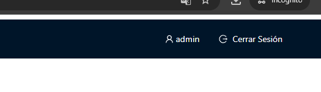
*Ingresamos las credenciales del admin con la contraseña 123456 y estaremos logueados como admin*


---

### IA en el Sistema

**Evidencia:**
*(Aquí va la captura del código fuente)*


**Descripción:** *(Breve explicación de la sección de código mejorado que hace posible el funcionamiento de la IA en el sistema).*

---

## 2. Hallazgos

### Activo 1: Servidor de base de datos
* **Evidencia:** 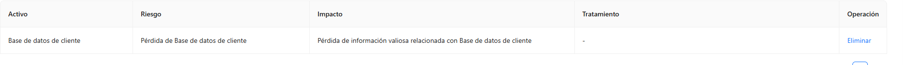 
* **Condición:** Pérdida de información valiosa relacionada con Base de datos de cliente
* **Recomendación:** Cifrado de datos sensibles
* **Riesgo:** Media, Pérdida de Base de datos de cliente

### Activo 2: API Transacciones
* **Evidencia:** 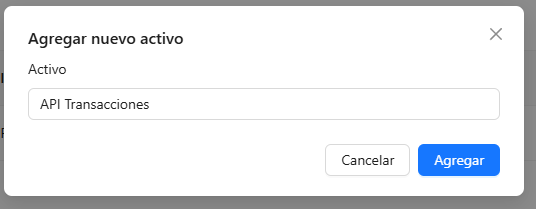
* **Condición:** Pérdida de información valiosa relacionada con API Transacciones
* **Recomendación:** Implementación de controles de acceso físico
* **Riesgo:** Alta, Pérdida de API Transacciones

### Activo 3: Aplicación Web de Banca
* **Evidencia:** 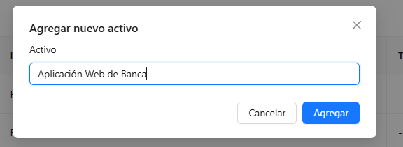
* **Condición:** Pérdida de información valiosa relacionada con API Transacciones
* **Recomendación:** Monitoreo continuo de accesos
* **Riesgo:** Baja, Pérdida de API Transacciones

### Activo 4: Servidor de Correo 
* **Evidencia:** 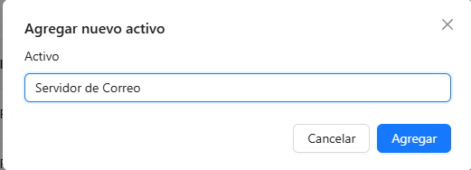
* **Condición:** Implementación de firewall de nueva generación 
* **Recomendación:** Monitoreo continuo de accesos
* **Riesgo:** Probabilidad (Baja/Media/Alta)

### Activo 5: Firewall Perimetral
* **Evidencia:** 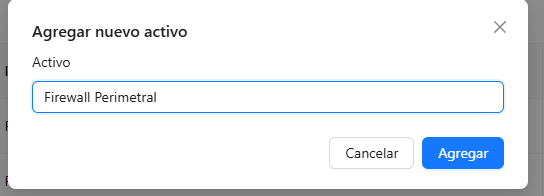
* **Condición:** Pérdida de información valiosa relacionada con Firewall Perimetral
* **Recomendación:** Monitoreo continuo de accesos 
* **Riesgo:** Alta, Pérdida de Servidor de Correo

---

## Anexo 1: Activos de información

| #  | Activo                                | Tipo               |
|----|---------------------------------------|--------------------|
| 1  | Servidor de base de datos             | Base de Datos      |
| 2  | API Transacciones                     | Servicio Web       |
| 3  | Aplicación Web de Banca               | Aplicación         |
| 4  | Servidor de Correo                    | Infraestructura    |
| 5  | Firewall Perimetral                   | Seguridad          |
| 6  | Autenticación MFA                     | Seguridad          |
| 7  | Registros de Auditoría                | Información        |
| 8  | Backup en NAS                         | Almacenamiento     |
| 9  | Servidor DNS Interno                  | Red                |
| 10 | Plataforma de Pagos Móviles           | Aplicación         |
| 11 | VPN Corporativa                       | Infraestructura    |
| 12 | Red de Cajeros Automáticos            | Infraestructura    |
| 13 | Servidor FTP                          | Red                |
| 14 | CRM Bancario                          | Aplicación         |
| 15 | ERP Financiero                        | Aplicación         |
| 16 | Base de Datos Clientes                | Información        |
| 17 | Logs de Seguridad                     | Información        |
| 18 | Servidor Web Apache                   | Infraestructura    |
| 19 | Consola de Gestión de Incidentes      | Seguridad          |
| 20 | Políticas de Seguridad Documentadas   | Documentación      |
| 21 | Módulo KYC (Know Your Customer)       | Aplicación         |
| 22 | Contraseñas de Usuarios               | Información        |
| 23 | Dispositivo HSM                       | Seguridad          |
| 24 | Certificados Digitales SSL            | Seguridad          |
| 25 | Panel de Administración de Usuarios   | Aplicación         |
| 26 | Red Wi-Fi Interna                     | Red                |
| 27 | Sistema de Control de Acceso Físico   | Infraestructura    |
| 28 | Sistema de Video Vigilancia           | Infraestructura    |
| 29 | Bot de Atención al Cliente            | Servicio Web       |
| 30 | Código Fuente del Core Bancario       | Información        |
| 31 | Tabla de Usuarios y Roles             | Información        |
| 32 | Documentación Técnica                 | Documentación      |
| 33 | Manuales de Usuario                   | Documentación      |
| 34 | Script de Backups Automáticos         | Seguridad          |
| 35 | Datos de Transacciones Diarias        | Información        |
| 36 | Herramienta SIEM                      | Seguridad          |
| 37 | Switches y Routers                    | Red                |
| 38 | Plan de Recuperación ante Desastres   | Documentación      |
| 39 | Contratos Digitales                   | Información Legal  |
| 40 | Archivos de Configuración de Servidores| Información        |
| 41 | Infraestructura en la Nube            | Infraestructura    |
| 42 | Correo Electrónico Ejecutivo          | Información        |
| 43 | Panel de Supervisión Financiera       | Aplicación         |
| 44 | App Móvil para Clientes               | Aplicación         |
| 45 | Token de Acceso a APIs                | Seguridad          |
| 46 | Base de Datos Histórica               | Información        |
| 47 | Entorno de Desarrollo                 | Infraestructura    |
| 48 | Sistema de Alertas de Seguridad       | Seguridad          |
| 49 | Configuración del Cortafuegos         | Seguridad          |
| 50 | Redundancia de Servidores             | Infraestructura    |

---

## Anexo 2: Rúbrica de Evaluación

*La nota final es la suma de todos los criterios (máx. 20 puntos).*

| Criterio                     | 0 pts                                         | 5 pts                                                       | Puntaje Máximo |
|------------------------------|-----------------------------------------------|-------------------------------------------------------------|:--------------:|
| **Login** | No presenta evidencia o está incorrecto       | Login ficticio completo, funcional y con evidencia clara    | 5              |
| **IA Funcionando** | No presenta IA o está incorrecta              | IA implementada, funcionando y con evidencia clara          | 5              |
| **Evaluación de 5 Activos** | Menos de 5 activos evaluados o sin hallazgos válidos | 5 activos evaluados con hallazgos claros y evidencias       | 5              |
| **Informe claro y completo** | Informe ausente, incompleto o poco entendible | Informe bien estructurado y completo según lo requerido      | 5              |